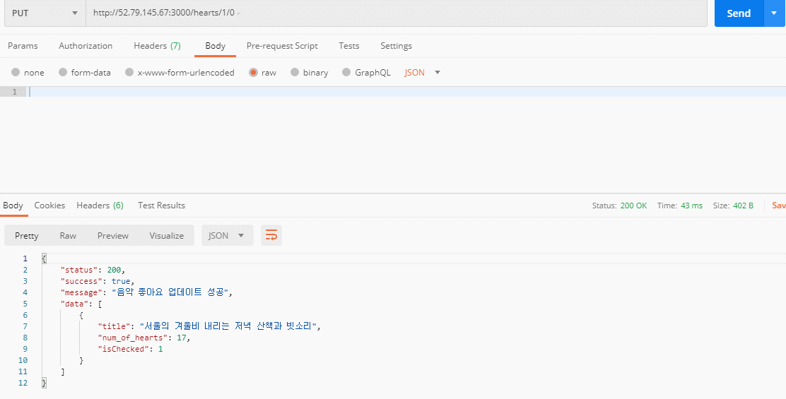

# 쉼표

## 사운즈 여행, 당신의 방을 여행 공간으로

### 1일 1깡 ? No. No. 1일 1쉼표의 API를 보고 싶다면 ?👇

[https://github.com/soptkathon/soptkathon-server/wiki](https://github.com/soptkathon/soptkathon-server/wiki)

- 좋아요를 누르면 isChecked값을 반전키고 전체 좋아요 개수를 증가시켜줘요!!
- 좋아요를 취소하면 isChecked를 반전시키고 젠체 좋아요 개수를 감소시켜요 ㅠㅠ

