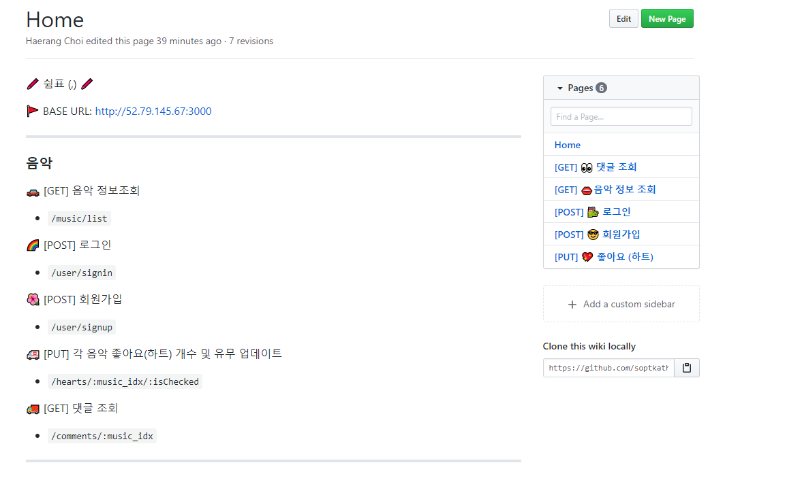
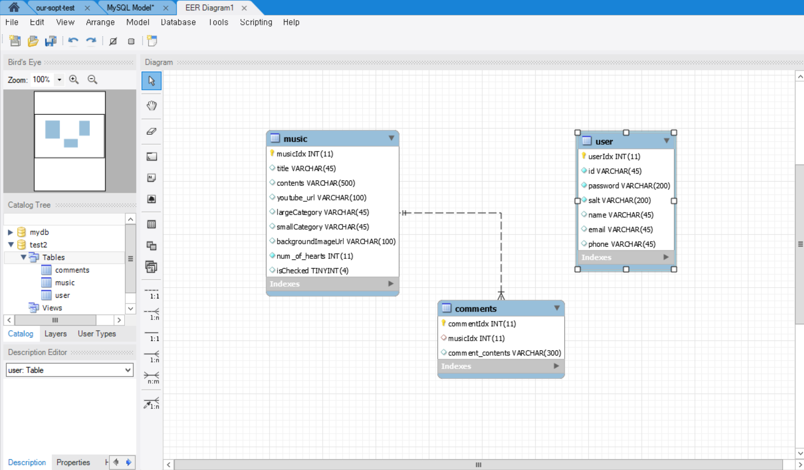
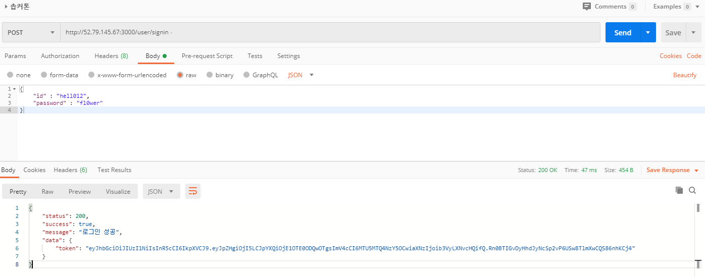

# 쉼표

## 사운즈 여행, 당신의 방을 여행 공간으로

### 1일 1깡 ? No. No. 1일 1쉼표의 API를 보고 싶다면 ?👇

[https://github.com/soptkathon/soptkathon-server/wiki](https://github.com/soptkathon/soptkathon-server/wiki)

## 저희의 ERD 💘 데이터 만드는 것도 게을리하지 않았죠

## 💖💖 하트하트 이 음악 좋아요

- 좋아요를 누르면 isChecked값을 반전키고 전체 좋아요 개수를 증가시켜줘요!!
- 좋아요를 취소하면 isChecked를 반전시키고 젠체 좋아요 개수를 감소시켜요 ㅠㅠ

## 회원가입에 토큰까지!! 보이지 않는 곳까지 성실한 서버팀원에게 감동받았어요 💦

